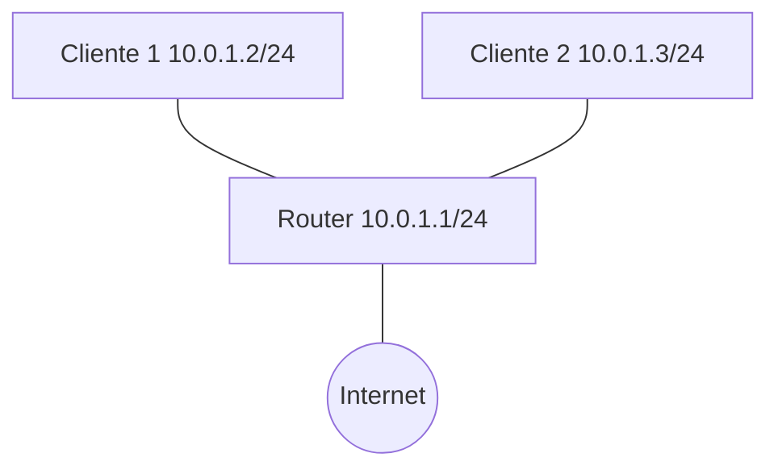

# Laboratorio 01 – Fundamentos de Redes y Encapsulación

## Contexto empresarial

La empresa **Networking SecOps** acaba de abrir una nueva oficina. Cuenta con dos empleados que necesitan compartir archivos y acceder a Internet. No hay infraestructura de red aún. Se te ha encargado **diseñar e implementar la red local** que permita la comunicación entre los equipos y el acceso a la web. Además, debes **demostrar cómo viajan los datos** desde un equipo hasta el router y cómo se encapsulan en cada capa.

## Problema inicial

-   Dos PCs (Cliente1 y Cliente2) deben comunicarse entre sí.
-   Ambas necesitan salir a Internet a través de un router.
-   No se dispone de equipos físicos, pero se puede utilizar **Linux** con herramientas de virtualización de red (namespaces, veth, etc.) para simular la topología.

## Objetivos del laboratorio

1.  Comprender el concepto de red y sus componentes.
2.  Implementar una red local sencilla usando **namespaces de red** en Linux.
3.  Asignar direcciones IP y comprobar conectividad.
4.  Observar el proceso de **encapsulación** mediante captura de paquetes con `tcpdump`.
5.  Analizar el flujo de datos desde la generación hasta la transmisión.

## Herramientas necesarias

-   Linux (Debian/Ubuntu recomendado) con privilegios de superusuario.
-   Comandos: `ip`, `ping`, `tcpdump`, `nslookup`, `curl`.
-   Editor de texto para scripts (opcional).

## Topología



**Direccionamiento:**

| Dispositivo | Interfaz | Dirección IP       |
|-------------|----------|--------------------|
| Cliente 1   | veth0    | 10.0.1.2/24        |
| Cliente 2   | veth0    | 10.0.1.3/24        |
| Router      | eth0     | 10.0.1.1/24        |
| (Internet)  | eth1     | (DHCP o fija)      |

## Construcción de la red

Usaremos **namespaces de red** para aislar cada dispositivo en un entorno virtual dentro de la misma máquina Linux. Esto nos permite simular una red sin necesidad de hardware extra.

### Paso 1: Verificar el entorno

Asegúrate de tener permisos de root:

```bash
sudo -i
```

### Paso 2: Crear los namespaces

Creamos un namespace para cada dispositivo:

```bash
ip netns add cliente1
ip netns add cliente2
ip netns add router
```

Verificamos que se hayan creado:

```bash
ip netns list
```

**Salida esperada:**
```
router
cliente2
cliente1
```

### Paso 3: Crear los pares de interfaces virtuales (veth)

Necesitamos conectar cada cliente al router. Para ello, creamos dos pares veth:

```bash
# Par para Cliente 1
ip link add veth-c1 type veth peer name veth-r1

# Par para Cliente 2
ip link add veth-c2 type veth peer name veth-r2
```

### Paso 4: Asignar cada extremo a su namespace

```bash
# Cliente 1
ip link set veth-c1 netns cliente1

# Cliente 2
ip link set veth-c2 netns cliente2

# Router (extremos r1 y r2)
ip link set veth-r1 netns router
ip link set veth-r2 netns router
```

### Paso 5: Configurar direcciones IP y activar interfaces

**Cliente 1:**

```bash
ip netns exec cliente1 ip addr add 10.0.1.2/24 dev veth-c1
ip netns exec cliente1 ip link set veth-c1 up
ip netns exec cliente1 ip link set lo up
```

**Cliente 2:**

```bash
ip netns exec cliente2 ip addr add 10.0.1.3/24 dev veth-c2
ip netns exec cliente2 ip link set veth-c2 up
ip netns exec cliente2 ip link set lo up
```

**Router – Usaremos un bridge para conectar ambos clientes:**

```bash
# En el namespace router
ip netns exec router ip link add br0 type bridge
ip netns exec router ip link set veth-r1 master br0
ip netns exec router ip link set veth-r2 master br0
ip netns exec router ip addr add 10.0.1.1/24 dev br0
ip netns exec router ip link set br0 up
ip netns exec router ip link set veth-r1 up
ip netns exec router ip link set veth-r2 up
```

### Paso 6: Configurar la salida a Internet (opcional)

Si queremos que los clientes accedan a Internet, necesitamos conectar el router a una interfaz externa (por ejemplo, `eth0` del host) y habilitar NAT. Esto lo haremos en el laboratorio 02 para no complicar ahora. Por ahora nos centramos en la comunicación local.

### Paso 7: Verificar conectividad entre clientes

Desde Cliente 1, hacemos ping a Cliente 2:

```bash
ip netns exec cliente1 ping -c 4 10.0.1.3
```

**Salida esperada:** 4 respuestas exitosas.

Desde Cliente 2 a Cliente 1:

```bash
ip netns exec cliente2 ping -c 4 10.0.1.2
```

**Salida esperada:** 4 respuestas exitosas.

### Paso 8: Verificar conectividad con el router

Desde Cliente 1 al router:

```bash
ip netns exec cliente1 ping -c 4 10.0.1.1
```

**Salida esperada:** 4 respuestas exitosas.

## Observación de la encapsulación

Vamos a capturar el tráfico en el router para ver cómo viaja un paquete ICMP (ping) desde Cliente 1 a Cliente 2.

### Paso 9: Iniciar captura en el router

Abrimos otra terminal (o usamos `tmux`) y ejecutamos:

```bash
ip netns exec router tcpdump -i br0 -n -v icmp
```

### Paso 10: Enviar un ping desde Cliente 1

En la terminal original:

```bash
ip netns exec cliente1 ping -c 1 10.0.1.3
```

### Paso 11: Analizar la captura

Deberías ver una salida similar a:

```
tcpdump: listening on br0, link-type EN10MB (Ethernet), capture size 262144 bytes
14:23:45.678901 IP (tos 0x0, ttl 64, id 12345, offset 0, flags [DF], proto ICMP (1), length 84)
    10.0.1.2 > 10.0.1.3: ICMP echo request, id 1, seq 1, length 64
14:23:45.678987 IP (tos 0x0, ttl 64, id 54321, offset 0, flags [none], proto ICMP (1), length 84)
    10.0.1.3 > 10.0.1.2: ICMP echo reply, id 1, seq 1, length 64
```

**Interpretación:**

-   Se ve la trama Ethernet (link-type EN10MB) que contiene el paquete IP.
-   El paquete IP tiene origen 10.0.1.2 y destino 10.0.1.3.
-   El protocolo es ICMP (1).
-   Los datos ICMP (echo request/reply) están encapsulados dentro del paquete IP, que a su vez va dentro de la trama Ethernet.

Podemos ver más detalles si usamos `-e` para mostrar la cabecera Ethernet:

```bash
ip netns exec router tcpdump -i br0 -n -e icmp
```

Aparecerán direcciones MAC de origen y destino, lo que confirma la encapsulación en la capa de enlace.

## Análisis del flujo de datos

1.  **Cliente 1 genera el mensaje:** La aplicación `ping` crea un mensaje ICMP Echo Request.
2.  **Capa de transporte:** ICMP no usa puertos, pero se considera parte de la capa de red en el modelo TCP/IP. A efectos prácticos, el mensaje se entrega a la capa IP.
3.  **Capa de red (IP):** Se añade el encabezado IP con origen 10.0.1.2 y destino 10.0.1.3.
4.  **Capa de enlace:** Se añade la cabecera Ethernet con MAC origen (de veth-c1) y MAC destino (de veth-r1, que es la interfaz del router conectada a br0).
5.  **El router recibe la trama**, la desencapsula (elimina cabecera Ethernet), consulta su tabla de reenvío y ve que el destino está en la misma red (br0). Entonces reenvía el paquete por la misma interfaz pero con nueva trama Ethernet (origen: MAC del router, destino: MAC de Cliente 2).
6.  **Cliente 2 recibe la trama**, la desencapsula y entrega el mensaje ICMP a la aplicación, que genera la respuesta y repite el proceso inverso.

## Conclusiones técnicas

-   Hemos implementado una red funcional utilizando **namespaces de red**, que simulan dispositivos independientes.
-   Hemos verificado la conectividad capa a capa (IP y Ethernet).
-   Mediante `tcpdump` hemos observado la **encapsulación** en tiempo real:
    -   Datos → ICMP (mensaje) → IP (paquete) → Ethernet (trama).
-   El router ha actuado como conmutador (switch) dentro de la misma subred, ya que no ha necesitado enrutar.
-   Este laboratorio sienta las bases para los siguientes, donde agregaremos más dispositivos, VLANs, enrutamiento y servicios.

## Errores comunes y soluciones

| Error | Causa | Solución |
|-------|-------|----------|
| `ping: connect: Network is unreachable` | No se ha asignado IP o la interfaz está down. | Verificar `ip addr show` y `ip link set ... up`. |
| `tcpdump: no suitable device found` | El dispositivo no existe o no se ha activado. | Asegurar que el bridge esté up. |
| No se ven paquetes en tcpdump | La captura está en interfaz incorrecta. | Capturar en `br0` o en `any`. |
| Los clientes no pueden hacer ping al router | El router no tiene la IP en la interfaz correcta. | Verificar que `br0` tenga la IP y esté up. |

## Preparación para el siguiente laboratorio

Hemos dejado la red con los dos clientes y el router (con bridge). En el **Laboratorio 02** agregaremos una conexión a Internet mediante NAT y configuraremos el enrutamiento para que los clientes puedan salir a la web.

---

**¡Laboratorio 01 completado!** Has construido tu primera red virtual y has observado cómo se encapsulan los datos. Continúa con el **Laboratorio 02**.
