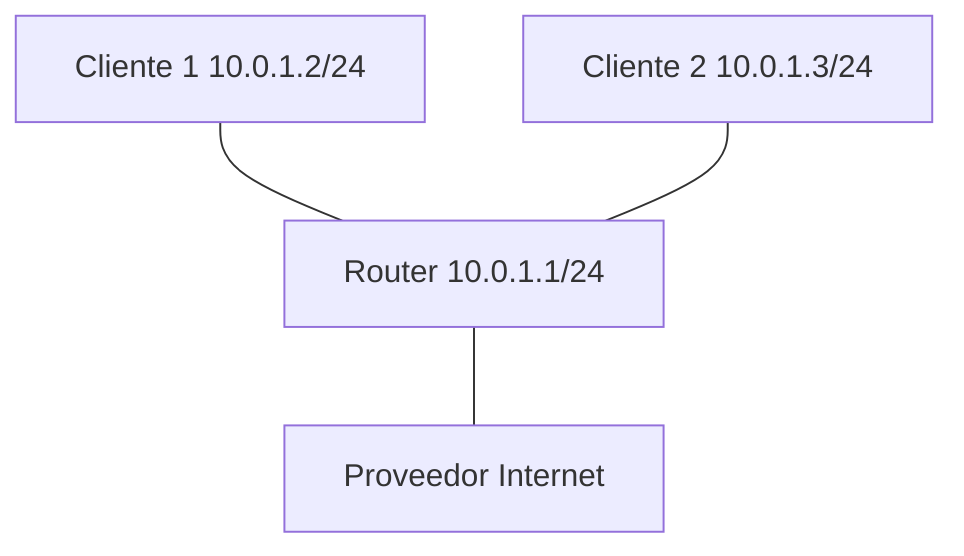

# Laboratorio 02 – Transmisión de Datos y Capa Física

## Contexto empresarial

La empresa **Networking SecOps** ya cuenta con su red local funcionando (Clientes 1 y 2 conectados al router mediante bridge). El equipo de operaciones ha notado que la red funciona correctamente para comunicaciones internas, pero necesitan **conectar la oficina a Internet** para que los empleados puedan acceder a servicios en la nube, correo electrónico y navegación web.

El CTO ha solicitado que, además de implementar la salida a Internet, se **documente el proceso de transmisión de datos**, explicando cómo viajan los bits desde el equipo del usuario hasta el router y cómo se comporta la señal en el medio físico.

## Problema inicial

-   Los clientes (10.0.1.2 y 10.0.1.3) no tienen salida a Internet.
-   El router tiene conectividad hacia Internet a través de la interfaz `eth0` del host, pero no está configurado para compartir esa conexión.
-   Se requiere habilitar **NAT (Network Address Translation)** para que los clientes puedan salir a Internet con la IP pública del router.
-   Además, se debe **analizar el flujo de bits** y observar cómo se transmite la información a nivel físico.

## Objetivos del laboratorio

1.  Comprender los conceptos de transmisión de datos: bits, señales digitales/analógicas, codificación y modulación.
2.  Implementar conectividad a Internet mediante NAT en el router.
3.  Configurar las rutas por defecto para que los clientes salgan a través del router.
4.  Capturar y analizar paquetes para observar el flujo de datos.
5.  Medir el rendimiento y la latencia en la red.

## Herramientas necesarias

-   Linux con privilegios de superusuario.
-   Comandos: `ip`, `ping`, `tcpdump`, `curl`, `iwconfig` (si se usa WiFi).
-   Herramientas de medición: `ping`, `traceroute`, `iperf3` (opcional).

## Topología



**Direccionamiento:**

| Dispositivo | Interfaz | Dirección IP       |
|-------------|----------|--------------------|
| Cliente 1   | veth0    | 10.0.1.2/24        |
| Cliente 2   | veth0    | 10.0.1.3/24        |
| Router (LAN)| br0      | 10.0.1.1/24        |
| Router (WAN)| veth-wan | 192.168.1.2/24    |
| Host        | eth0     | 192.168.1.1/24    |

Nota: La IP del host (192.168.1.1) debe ser la que tenga tu máquina real. Si usas WiFi, puede ser 192.168.0.x, 10.0.0.x, etc. Ajusta según tu entorno.

## Construcción de la red

### Paso 1: Verificar el estado actual

Primero, asegurémonos de que la red del laboratorio 01 sigue funcionando:

```bash
# Verificar namespaces
ip netns list

# Verificar conectividad entre clientes
ip netns exec cliente1 ping -c 2 10.0.1.3
```

Si no existen los namespaces, ejecuta los comandos del laboratorio 01 para crearlos.

### Paso 2: Crear una interfaz WAN para el router

Ahora vamos a conectar el router a la red exterior. Usaremos la interfaz de red del host (ej. `eth0`, `wlan0`) y crearemos un par veth.

```bash
# Crear par veth para la conexión WAN
ip link add veth-host type veth peer name veth-wan

# Asignar veth-host al host (namespace root)
# veth-wan lo asignamos al router
ip link set veth-wan netns router
```

### Paso 3: Configurar IP en la interfaz WAN del router

Necesitamos que el router tenga una IP en la misma subred que el host. Asumimos que el host tiene IP 192.168.1.1/24.

```bash
# Configurar IP en el router
ip netns exec router ip addr add 192.168.1.2/24 dev veth-wan
ip netns exec router ip link set veth-wan up

# Configurar IP en el host
ip addr add 192.168.1.1/24 dev veth-host
ip link set veth-host up
```

**Nota:** Si tu host tiene una IP diferente (ej. 10.0.0.1), ajusta las IPs. Para saber tu IP, ejecuta `ip addr show` y busca la interfaz activa.

### Paso 4: Habilitar NAT en el router

NAT permite que los clientes de la red local (10.0.1.0/24) salgan a Internet usando la IP del router (192.168.1.2).

```bash
# Habilitar forwarding en el router
ip netns exec router sysctl -w net.ipv4.ip_forward=1

# Configurar NAT en el router
ip netns exec router iptables -t nat -A POSTROUTING -o veth-wan -j MASQUERADE
ip netns exec router iptables -A FORWARD -i br0 -o veth-wan -j ACCEPT
ip netns exec router iptables -A FORWARD -i veth-wan -o br0 -m state --state RELATED,ESTABLISHED -j ACCEPT
```

### Paso 5: Configurar ruta por defecto en los clientes

Los clientes deben enviar todo el tráfico que no sea para la red local al router (10.0.1.1).

```bash
# Cliente 1
ip netns exec cliente1 ip route add default via 10.0.1.1

# Cliente 2
ip netns exec cliente2 ip route add default via 10.0.1.1
```

### Paso 6: Configurar ruta en el host para que el tráfico de retorno llegue al router

Para que el tráfico de Internet llegue de vuelta al router, el host necesita saber cómo llegar a 10.0.1.0/24:

```bash
ip route add 10.0.1.0/24 via 192.168.1.2
```

### Paso 7: Verificar conectividad a Internet

Ahora los clientes deberían poder acceder a Internet:

```bash
# Desde Cliente 1
ip netns exec cliente1 ping -c 4 8.8.8.8

# Desde Cliente 1, resolver DNS
ip netns exec cliente1 nslookup google.com

# Desde Cliente 1, hacer una petición web
ip netns exec cliente1 curl -I http://google.com
```

**Salida esperada:**
- `ping` 0% de pérdida.
- `nslookup` devuelve una IP.
- `curl` devuelve un código HTTP 301 o 200.

## Observación de la transmisión de datos

### Paso 8: Capturar el flujo de datos durante una solicitud web

Vamos a observar cómo viajan los datos desde el cliente hasta Internet.

```bash
# Iniciar captura en el router (interfaz br0 y veth-wan)
ip netns exec router tcpdump -i any -n -v -c 10 'host 8.8.8.8 or host google.com'
```

En otra terminal, ejecutar:

```bash
ip netns exec cliente1 curl -s http://google.com > /dev/null
```

### Paso 9: Analizar la captura

Deberías ver paquetes que salen por `br0` (desde el cliente) y por `veth-wan` (hacia Internet).

```
14:23:45.678901 br0  In  IP 10.0.1.2.54321 > 8.8.8.8.80: Flags [S], seq 123456
14:23:45.678902 veth-wan Out IP 192.168.1.2.54321 > 8.8.8.8.80: Flags [S], seq 123456
14:23:45.679001 veth-wan In  IP 8.8.8.8.80 > 192.168.1.2.54321: Flags [S.], seq 789012
14:23:45.679002 br0  Out IP 10.0.1.1.80 > 10.0.1.2.54321: Flags [S.], seq 789012
```

**Interpretación:**

1.  El cliente (10.0.1.2) envía un SYN a 8.8.8.8.
2.  El router recibe el paquete y cambia la IP origen por la suya (192.168.1.2) gracias a NAT.
3.  El paquete sale por veth-wan hacia el host y luego a Internet.
4.  La respuesta llega al router y éste la redirige al cliente.
5.  Se observa claramente el cambio de IP en el proceso de traducción.

## Análisis de la transmisión de datos

### Bits y señales

Cuando ejecutas `ping` o `curl`, los datos generados por la aplicación se convierten en:

1.  **Bits**: La información se codifica como unos y ceros.
2.  **Señal digital**: Los bits se convierten en señales eléctricas/ópticas.
3.  **Transmisión**: La señal viaja por el medio (cable o aire).

En una red Ethernet real, el esquema de codificación más común hoy es **PAM5** (1000BASE-T) o **PAM16** (10GBASE-T), que transmiten múltiples bits por símbolo.

### Modulación en medios inalámbricos

Si el enlace incluye WiFi, la señal se modula usando **QAM (Quadrature Amplitude Modulation)**:

-   64-QAM → 6 bits por símbolo.
-   256-QAM → 8 bits por símbolo.

Cuantos más bits por símbolo, mayor velocidad, pero se requiere mejor SNR (Relación Señal/Ruido).

### Ancho de banda y rendimiento

En nuestro laboratorio, el enlace entre el cliente y el router está limitado por la velocidad de las interfaces veth (virtuales). En una red real, mediríamos:

-   **Throughput**: cantidad de datos por segundo.
-   **Latencia**: tiempo de ida y vuelta (RTT).
-   **Jitter**: variación en la latencia.

Para medir rendimiento, podemos usar `iperf3`:

```bash
# En el router (servidor)
ip netns exec router iperf3 -s

# En Cliente 1 (cliente)
ip netns exec cliente1 iperf3 -c 10.0.1.1
```

### Medición de latencia

Podemos medir la latencia hacia Internet:

```bash
ip netns exec cliente1 ping -c 10 8.8.8.8
```

La salida mostrará el tiempo mínimo, promedio y máximo (RTT).

## Ejercicios prácticos

### Ejercicio 1: Observar la tabla de enrutamiento

En el router, muestra la tabla de rutas:

```bash
ip netns exec router ip route show
```

**Preguntas:**
- ¿Qué rutas tiene el router?
- ¿Cómo sabe el router que debe enviar el tráfico a 10.0.1.0/24 por br0?
- ¿Qué ruta usa para Internet?

### Ejercicio 2: Ver las reglas de NAT

En el router, muestra las reglas de iptables:

```bash
ip netns exec router iptables -t nat -L -v
```

**Preguntas:**
- ¿Qué regla de NAT está activa?
- ¿Cuántos paquetes han sido traducidos?

### Ejercicio 3: Medir throughput

Instala `iperf3` si no lo tienes y mide el rendimiento entre Cliente 1 y el router.

```bash
# En el router (servidor)
ip netns exec router iperf3 -s &

# En Cliente 1
ip netns exec cliente1 iperf3 -c 10.0.1.1
```

**Pregunta:** ¿Cuál es el throughput alcanzado? ¿Por qué no llega a 1 Gbps?

## Errores comunes y soluciones

| Error | Causa | Solución |
|-------|-------|----------|
| `ping: connect: Network is unreachable` | No hay ruta por defecto. | Ejecutar `ip route add default via 10.0.1.1` en el cliente. |
| No sale a Internet | NAT no configurado. | Verificar reglas de iptables y que `ip_forward=1`. |
| `curl: (6) Could not resolve host` | DNS no configurado. | Configurar DNS en el cliente: `echo 'nameserver 8.8.8.8' > /etc/resolv.conf` (dentro del namespace). |
| Los paquetes no llegan al host | Host no tiene ruta de retorno. | Agregar ruta en el host: `ip route add 10.0.1.0/24 via 192.168.1.2`. |

## Conclusiones técnicas

En este laboratorio hemos:

1.  **Ampliado la red local** agregando conectividad a Internet mediante NAT.
2.  **Observado el flujo de datos** desde el cliente hasta el router y luego hacia Internet.
3.  **Comprendido la transmisión de datos** a nivel de bits, señales y modulación.
4.  **Medido el rendimiento** y la latencia de la red.
5.  **Analizado el proceso de encapsulación** y la traducción de direcciones (NAT).

Los conceptos de transmisión de datos son fundamentales para entender las limitaciones y capacidades de las redes. El ancho de banda, la latencia, el ruido y la modulación determinan el rendimiento real que los usuarios experimentan.

## Preparación para el siguiente laboratorio

Hemos dejado la red con salida a Internet, NAT y rutas configuradas. En el **Laboratorio 03** agregaremos más dispositivos: un switch con múltiples clientes y configuración de VLANs para segmentar el tráfico.

---

**¡Laboratorio 02 completado!** Ahora los clientes tienen acceso a Internet y hemos analizado el proceso de transmisión de datos. Continúa con el **Laboratorio 03**.
