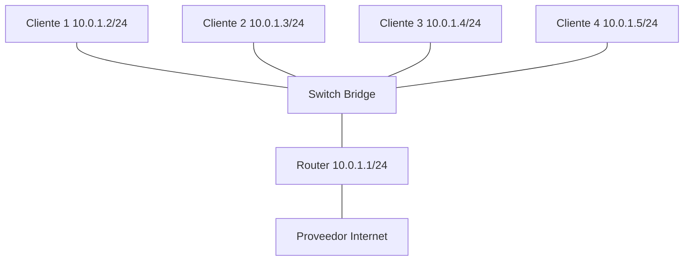

# Laboratorio 03 – Componentes de Red y Conmutación

## Contexto empresarial

La empresa **Networking SecOps** ha crecido. Ahora hay **4 empleados** en la oficina, cada uno con su propio equipo. La red actual (Cliente 1 y Cliente 2 conectados directamente al router) ya no es suficiente. Se necesita una **infraestructura más organizada** que permita conectar múltiples dispositivos de forma escalable y eficiente.

El equipo de TI ha decidido implementar un **switch** para centralizar las conexiones de los clientes, y así: 

-   Reducir el tráfico innecesario en el router.
-   Permitir la comunicación directa entre clientes sin pasar por el router.
-   Facilitar la expansión futura (más clientes, VLANs, etc.).

Además, se debe **documentar el funcionamiento del switch**: cómo aprende direcciones MAC, cómo reenvía tramas y cómo segmenta el tráfico.

## Problema inicial

-   La red actual tiene solo 2 clientes conectados directamente al router vía bridge.
-   Se necesita conectar **4 clientes** (Cliente 1, 2, 3 y 4).
-   El router debe mantener su función de enrutamiento y NAT hacia Internet.
-   Se debe implementar un **switch** (bridge en Linux) que interconecte a todos los clientes.

## Objetivos del laboratorio

1.  Comprender la función de los **dispositivos finales** (hosts) y **dispositivos intermedios** (switch, router).
2.  Implementar un **switch** en Linux usando un bridge.
3.  Conectar **4 clientes** al switch y verificar su comunicación.
4.  Observar el **aprendizaje de direcciones MAC** en el switch.
5.  Analizar el **flujo de datos** en una red conmutada.
6.  Comprender el concepto de **MTU** y su impacto en la transmisión.

## Herramientas necesarias

-   Linux con privilegios de superusuario.
-   Comandos: `ip`, `ping`, `tcpdump`, `bridge`, `ethtool`.
-   Conocimientos básicos de direccionamiento MAC e IP.

## Topología



**Direccionamiento:**

| Dispositivo | Interfaz | Dirección IP       |
|-------------|----------|--------------------|
| Cliente 1   | veth0    | 10.0.1.2/24        |
| Cliente 2   | veth0    | 10.0.1.3/24        |
| Cliente 3   | veth0    | 10.0.1.4/24        |
| Cliente 4   | veth0    | 10.0.1.5/24        |
| Switch      | br0      | - (capa 2)         |
| Router (LAN)| br0      | 10.0.1.1/24        |
| Router (WAN)| veth-wan | 192.168.1.2/24    |

## Construcción de la red

### Paso 1: Verificar el estado actual

Asegurémonos de que el laboratorio 02 está funcionando:

```bash
# Verificar namespaces
ip netns list

# Verificar conectividad a Internet
ip netns exec cliente1 ping -c 2 8.8.8.8
```

Si no existen los namespaces, ejecuta los comandos de los laboratorios 01 y 02 para crearlos.

### Paso 2: Eliminar la configuración anterior (bridge del router)

En el laboratorio 01, creamos un bridge `br0` dentro del router para conectar los clientes. Ahora vamos a mover ese bridge al **namespace del switch**.

```bash
# Eliminar el bridge del router
ip netns exec router ip link set br0 down
ip netns exec router ip link delete br0

# Desconectar las interfaces veth del router
ip netns exec router ip link set veth-r1 down
ip netns exec router ip link set veth-r2 down
ip link set veth-r1 netns 1
ip link set veth-r2 netns 1
```

### Paso 3: Crear el namespace del switch

```bash
ip netns add switch
```

### Paso 4: Crear el bridge en el switch

```bash
# Crear bridge en el namespace switch
ip netns exec switch ip link add br0 type bridge
ip netns exec switch ip link set br0 up
```

### Paso 5: Crear interfaces para los 4 clientes

```bash
# Cliente 1
ip link add veth-c1 type veth peer name veth-s1
ip link set veth-c1 netns cliente1
ip link set veth-s1 netns switch

# Cliente 2
ip link add veth-c2 type veth peer name veth-s2
ip link set veth-c2 netns cliente2
ip link set veth-s2 netns switch

# Cliente 3
ip link add veth-c3 type veth peer name veth-s3
ip link set veth-c3 netns cliente3
ip link set veth-s3 netns switch

# Cliente 4
ip link add veth-c4 type veth peer name veth-s4
ip link set veth-c4 netns cliente4
ip link set veth-s4 netns switch
```

### Paso 6: Crear el namespace del Cliente 3 y Cliente 4

```bash
ip netns add cliente3
ip netns add cliente4
```

### Paso 7: Configurar los clientes

```bash
# Cliente 1 (ya existente, solo configurar IP si no tiene)
ip netns exec cliente1 ip addr add 10.0.1.2/24 dev veth-c1 || true
ip netns exec cliente1 ip link set veth-c1 up
ip netns exec cliente1 ip link set lo up

# Cliente 2
ip netns exec cliente2 ip addr add 10.0.1.3/24 dev veth-c2 || true
ip netns exec cliente2 ip link set veth-c2 up
ip netns exec cliente2 ip link set lo up

# Cliente 3
ip netns exec cliente3 ip addr add 10.0.1.4/24 dev veth-c3
ip netns exec cliente3 ip link set veth-c3 up
ip netns exec cliente3 ip link set lo up
ip netns exec cliente3 ip route add default via 10.0.1.1

# Cliente 4
ip netns exec cliente4 ip addr add 10.0.1.5/24 dev veth-c4
ip netns exec cliente4 ip link set veth-c4 up
ip netns exec cliente4 ip link set lo up
ip netns exec cliente4 ip route add default via 10.0.1.1
```

### Paso 8: Conectar las interfaces del switch al bridge

```bash
# En el namespace switch
ip netns exec switch ip link set veth-s1 master br0
ip netns exec switch ip link set veth-s2 master br0
ip netns exec switch ip link set veth-s3 master br0
ip netns exec switch ip link set veth-s4 master br0
ip netns exec switch ip link set veth-s1 up
ip netns exec switch ip link set veth-s2 up
ip netns exec switch ip link set veth-s3 up
ip netns exec switch ip link set veth-s4 up
```

### Paso 9: Conectar el switch al router

Necesitamos un enlace entre el switch y el router:

```bash
# Crear par veth switch-router
ip link add veth-sr type veth peer name veth-rs
ip link set veth-sr netns switch
ip link set veth-rs netns router

# Conectar al bridge del switch
ip netns exec switch ip link set veth-sr master br0
ip netns exec switch ip link set veth-sr up

# Configurar IP en el router (interfaz hacia el switch)
ip netns exec router ip addr add 10.0.1.1/24 dev veth-rs
ip netns exec router ip link set veth-rs up
```

### Paso 10: Verificar conectividad entre clientes

```bash
# Cliente 1 a Cliente 3
ip netns exec cliente1 ping -c 4 10.0.1.4

# Cliente 2 a Cliente 4
ip netns exec cliente2 ping -c 4 10.0.1.5

# Cliente 3 al router
ip netns exec cliente3 ping -c 4 10.0.1.1
```

**Salida esperada:** Todas las pruebas con 0% de pérdida.

### Paso 11: Verificar conectividad a Internet

```bash
ip netns exec cliente3 ping -c 4 8.8.8.8
ip netns exec cliente4 curl -I http://google.com
```

## Observación del funcionamiento del switch

### Paso 12: Ver la tabla de direcciones MAC del switch

El switch aprende las direcciones MAC de los dispositivos conectados:

```bash
# Ver tabla MAC del bridge
ip netns exec switch bridge fdb show br br0
```

**Salida esperada:**

```
aa:bb:cc:00:01 dev veth-s1 master br0
aa:bb:cc:00:02 dev veth-s2 master br0
aa:bb:cc:00:03 dev veth-s3 master br0
aa:bb:cc:00:04 dev veth-s4 master br0
aa:bb:cc:00:ff dev veth-sr master br0
```

Cada dirección MAC está asociada a un puerto específico.

### Paso 13: Capturar tráfico en el switch

Para observar cómo el switch reenvía tramas, capturamos en todas las interfaces:

```bash
# Capturar en el switch (interfaz br0)
ip netns exec switch tcpdump -i br0 -n -e icmp
```

En otra terminal, enviamos un ping de Cliente 1 a Cliente 3:

```bash
ip netns exec cliente1 ping -c 1 10.0.1.4
```

**Interpretación de la captura:**

1.  Cliente 1 envía una trama con **MAC origen = aa:bb:cc:00:01** y **MAC destino = aa:bb:cc:00:03**.
2.  El switch recibe la trama por `veth-s1`.
3.  El switch consulta su tabla MAC y encuentra que la MAC destino está en `veth-s3`.
4.  El switch reenvía la trama **solo por `veth-s3`** (no por los demás puertos).
5.  Cliente 3 recibe la trama y responde.

**Esto demuestra la conmutación en capa 2:** el switch aprende y reenvía solo al puerto correcto, reduciendo el tráfico innecesario.

## Análisis de MTU

### Paso 14: Verificar la MTU actual

```bash
# Ver MTU de las interfaces
ip netns exec cliente1 ip link show veth-c1
```

**Salida esperada:** `mtu 1500`

### Paso 15: Probar MTU con ping

Enviamos un ping con tamaño mayor a 1500 bytes (con fragmentación):

```bash
# Ping con 2000 bytes (se fragmentará)
ip netns exec cliente1 ping -c 2 -M do -s 2000 10.0.1.4
```

**Salida esperada:**
-   Si la MTU es 1500, el ping fallará con `Frag needed and DF set`.
-   Si usamos `-M dont` (no fragmentar), el paquete se descarta.

Esto demuestra la importancia de la MTU: los paquetes que exceden el tamaño máximo son fragmentados o descartados.

### Paso 16: Cambiar MTU (opcional)

Podemos cambiar la MTU para soportar jumboframes:

```bash
ip netns exec cliente1 ip link set veth-c1 mtu 9000
ip netns exec switch ip link set veth-s1 mtu 9000
ip netns exec switch ip link set br0 mtu 9000
```

Ahora el ping con 9000 bytes debería funcionar (si todos los enlaces soportan jumboframes).

## Ejercicios prácticos

### Ejercicio 1: Observar el aprendizaje de MAC

1.  Limpiar la tabla MAC del switch:

    ```bash
    ip netns exec switch bridge fdb flush dev br0
    ```

2.  Enviar un ping de Cliente 1 a Cliente 2.
3.  Ver la tabla MAC nuevamente.
4.  **Pregunta:** ¿Cuánto tiempo tarda el switch en aprender la MAC de Cliente 2?

### Ejercicio 2: Broadcast en la red

1.  Enviar un ping de Cliente 1 a la dirección de broadcast `10.0.1.255`:

    ```bash
    ip netns exec cliente1 ping -c 1 -b 10.0.1.255
    ```

2.  Capturar en el switch para ver cómo se reenvía la trama de broadcast.
3.  **Pregunta:** ¿Por qué el switch envía el broadcast a todos los puertos?

### Ejercicio 3: Impacto de la MTU en el rendimiento

1.  Medir el throughput con MTU 1500:

    ```bash
    ip netns exec router iperf3 -s &
    ip netns exec cliente1 iperf3 -c 10.0.1.1
    ```

2.  Cambiar la MTU a 9000 en todos los enlaces y repetir la medición.
3.  **Pregunta:** ¿Mejora el throughput con jumboframes? ¿Por qué?

## Errores comunes y soluciones

| Error | Causa | Solución |
|-------|-------|----------|
| Los clientes no pueden hacer ping entre sí | El switch no tiene los puertos en el bridge. | Verificar `bridge link show`. |
| `ping: sendmsg: Operation not permitted` | MTU demasiado pequeña. | Aumentar MTU o usar `-M dont`. |
| El switch no aprende MAC | La interfaz está down. | Verificar `ip link set ... up`. |
| No sale a Internet | El router no tiene ruta al switch. | Verificar IP en `veth-rs` y que el switch esté conectado al router. |

## Conclusiones técnicas

En este laboratorio hemos:

1.  **Implementado una red conmutada** usando un bridge en Linux como switch.
2.  **Conectado 4 clientes** al switch y verificado su comunicación.
3.  **Observado el aprendizaje de direcciones MAC** en el switch.
4.  **Analizado el reenvío de tramas** en capa 2 (unicast, broadcast).
5.  **Comprendido el concepto de MTU** y su impacto en la transmisión.
6.  **Demostrado la escalabilidad** de una red conmutada.

El switch es un componente fundamental en las redes modernas. Su capacidad para aprender direcciones MAC y reenviar tráfico solo por el puerto correcto permite:

-   Mayor eficiencia en el uso del ancho de banda.
-   Reducción de colisiones (en redes conmutadas punto a punto).
-   Escalabilidad para conectar cientos o miles de dispositivos.
-   Base para implementar VLANs y otras tecnologías de segmentación.

La MTU, por su parte, es un parámetro crítico que debe ser configurado correctamente para evitar fragmentación y pérdida de rendimiento.

## Preparación para el siguiente laboratorio

Hemos dejado la red con 4 clientes conectados a un switch, y el switch conectado al router con salida a Internet. En el **Laboratorio 04** comenzaremos a trabajar con **direccionamiento IP y subredes**, segmentando la red en diferentes subredes y configurando el enrutamiento entre ellas.

---

**¡Laboratorio 03 completado!** Ahora tenemos una red conmutada escalable y hemos analizado el funcionamiento de los componentes de red. Continúa con el **Laboratorio 04**.
