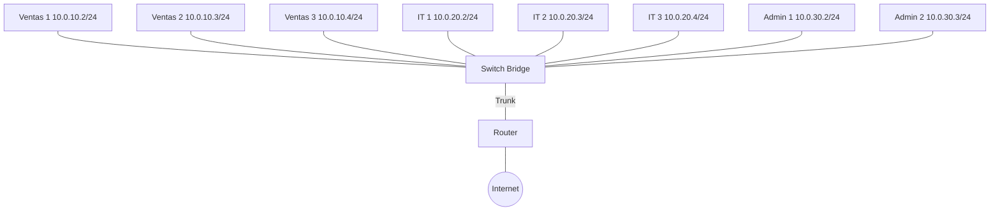

# Laboratorio 05 – Conmutación y Segmentación de Red

## Contexto empresarial

La empresa **Networking SecOps** ha crecido y ahora tiene **tres departamentos** con necesidades de red independientes:

-   **Ventas**: 10 empleados, necesitan acceso a Internet y a un servidor de archivos.
-   **IT/Sistemas**: 6 empleados, administran servidores y necesitan acceso restringido.
-   **Administración**: 4 empleados, incluyendo directivos que requieren acceso a datos sensibles.

La red actual tiene subredes separadas (Ventas e IT) pero **comparten el mismo switch físico**. Esto significa que:

-   El tráfico broadcast de un departamento afecta a los otros.
-   No hay aislamiento real a nivel de capa 2.
-   Un problema en una subred puede afectar a las demás.

Se necesita **segmentar la red físicamente** usando **VLANs** para:

-   Aislar el tráfico broadcast entre departamentos.
-   Mejorar la seguridad (un departamento no puede ver el tráfico de otro).
-   Facilitar la administración y expansión.

## Problema inicial

-   Todos los clientes están en el mismo switch físico (bridge).
-   Las subredes están separadas lógicamente, pero comparten el mismo dominio de broadcast.
-   Se necesitan **3 VLANs**: VLAN 10 (Ventas), VLAN 20 (IT), VLAN 30 (Administración).
-   El router debe enrutar entre VLANs mediante **subinterfaces (Router-on-a-Stick)**.
-   El switch debe soportar **trunking (802.1Q)** para transportar múltiples VLANs.

## Objetivos del laboratorio

1.  Comprender el concepto de **direcciones MAC** y su papel en la conmutación.
2.  Implementar **VLANs** para segmentar una red física en dominios lógicos.
3.  Configurar **trunking (IEEE 802.1Q)** para transportar múltiples VLANs.
4.  Implementar **Router-on-a-Stick** con subinterfaces para enrutar entre VLANs.
5.  Analizar los **dominios de broadcast** y cómo las VLANs los segmentan.

## Herramientas necesarias

-   Linux con privilegios de superusuario.
-   Comandos: `ip`, `ping`, `tcpdump`, `bridge`, `vlan`.

## Diseño de VLANs y direccionamiento

| VLAN | Nombre | Subred | Gateway |
|------|--------|--------|---------|
| 10 | Ventas | 10.0.10.0/24 | 10.0.10.1 |
| 20 | IT | 10.0.20.0/24 | 10.0.20.1 |
| 30 | Administración | 10.0.30.0/24 | 10.0.30.1 |
| 99 | Enlace (Native) | 10.0.99.0/30 | - |

## Topología



## Construcción de la red

### Paso 1: Limpiar configuración anterior

```bash
ip netns del ventas1 2>/dev/null || true
ip netns del ventas2 2>/dev/null || true
ip netns del ventas3 2>/dev/null || true
ip netns del it1 2>/dev/null || true
ip netns del it2 2>/dev/null || true
ip netns del it3 2>/dev/null || true
ip netns del admin1 2>/dev/null || true
ip netns del admin2 2>/dev/null || true
ip netns del router 2>/dev/null || true
ip netns del switch 2>/dev/null || true
```

### Paso 2: Crear namespaces

```bash
ip netns add router
ip netns add switch
ip netns add ventas1
ip netns add ventas2
ip netns add ventas3
ip netns add it1
ip netns add it2
ip netns add it3
ip netns add admin1
ip netns add admin2
```

### Paso 3: Crear bridge con VLAN filtering

```bash
ip netns exec switch ip link add br0 type bridge
ip netns exec switch ip link set br0 type bridge vlan_filtering 1
ip netns exec switch ip link set br0 up
```

### Paso 4: Configurar clientes VLAN 10 (Ventas)

```bash
# Ventas 1
ip link add veth-v1 type veth peer name veth-sv1
ip link set veth-v1 netns ventas1
ip link set veth-sv1 netns switch
ip netns exec ventas1 ip addr add 10.0.10.2/24 dev veth-v1
ip netns exec ventas1 ip link set veth-v1 up
ip netns exec ventas1 ip route add default via 10.0.10.1
ip netns exec switch ip link set veth-sv1 up
ip netns exec switch bridge vlan add dev veth-sv1 vid 10 pvid untagged
ip netns exec switch ip link set veth-sv1 master br0

# Ventas 2
ip link add veth-v2 type veth peer name veth-sv2
ip link set veth-v2 netns ventas2
ip link set veth-sv2 netns switch
ip netns exec ventas2 ip addr add 10.0.10.3/24 dev veth-v2
ip netns exec ventas2 ip link set veth-v2 up
ip netns exec ventas2 ip route add default via 10.0.10.1
ip netns exec switch ip link set veth-sv2 up
ip netns exec switch bridge vlan add dev veth-sv2 vid 10 pvid untagged
ip netns exec switch ip link set veth-sv2 master br0

# Ventas 3
ip link add veth-v3 type veth peer name veth-sv3
ip link set veth-v3 netns ventas3
ip link set veth-sv3 netns switch
ip netns exec ventas3 ip addr add 10.0.10.4/24 dev veth-v3
ip netns exec ventas3 ip link set veth-v3 up
ip netns exec ventas3 ip route add default via 10.0.10.1
ip netns exec switch ip link set veth-sv3 up
ip netns exec switch bridge vlan add dev veth-sv3 vid 10 pvid untagged
ip netns exec switch ip link set veth-sv3 master br0
```

### Paso 5: Configurar clientes VLAN 20 (IT)

```bash
# IT 1
ip link add veth-i1 type veth peer name veth-si1
ip link set veth-i1 netns it1
ip link set veth-si1 netns switch
ip netns exec it1 ip addr add 10.0.20.2/24 dev veth-i1
ip netns exec it1 ip link set veth-i1 up
ip netns exec it1 ip route add default via 10.0.20.1
ip netns exec switch ip link set veth-si1 up
ip netns exec switch bridge vlan add dev veth-si1 vid 20 pvid untagged
ip netns exec switch ip link set veth-si1 master br0

# IT 2
ip link add veth-i2 type veth peer name veth-si2
ip link set veth-i2 netns it2
ip link set veth-si2 netns switch
ip netns exec it2 ip addr add 10.0.20.3/24 dev veth-i2
ip netns exec it2 ip link set veth-i2 up
ip netns exec it2 ip route add default via 10.0.20.1
ip netns exec switch ip link set veth-si2 up
ip netns exec switch bridge vlan add dev veth-si2 vid 20 pvid untagged
ip netns exec switch ip link set veth-si2 master br0

# IT 3
ip link add veth-i3 type veth peer name veth-si3
ip link set veth-i3 netns it3
ip link set veth-si3 netns switch
ip netns exec it3 ip addr add 10.0.20.4/24 dev veth-i3
ip netns exec it3 ip link set veth-i3 up
ip netns exec it3 ip route add default via 10.0.20.1
ip netns exec switch ip link set veth-si3 up
ip netns exec switch bridge vlan add dev veth-si3 vid 20 pvid untagged
ip netns exec switch ip link set veth-si3 master br0
```

### Paso 6: Configurar clientes VLAN 30 (Administración)

```bash
# Admin 1
ip link add veth-a1 type veth peer name veth-sa1
ip link set veth-a1 netns admin1
ip link set veth-sa1 netns switch
ip netns exec admin1 ip addr add 10.0.30.2/24 dev veth-a1
ip netns exec admin1 ip link set veth-a1 up
ip netns exec admin1 ip route add default via 10.0.30.1
ip netns exec switch ip link set veth-sa1 up
ip netns exec switch bridge vlan add dev veth-sa1 vid 30 pvid untagged
ip netns exec switch ip link set veth-sa1 master br0

# Admin 2
ip link add veth-a2 type veth peer name veth-sa2
ip link set veth-a2 netns admin2
ip link set veth-sa2 netns switch
ip netns exec admin2 ip addr add 10.0.30.3/24 dev veth-a2
ip netns exec admin2 ip link set veth-a2 up
ip netns exec admin2 ip route add default via 10.0.30.1
ip netns exec switch ip link set veth-sa2 up
ip netns exec switch bridge vlan add dev veth-sa2 vid 30 pvid untagged
ip netns exec switch ip link set veth-sa2 master br0
```

### Paso 7: Configurar trunk (802.1Q)

```bash
ip link add veth-sr type veth peer name veth-rs
ip link set veth-sr netns switch
ip link set veth-rs netns router
ip netns exec switch ip link set veth-sr up
ip netns exec switch bridge vlan add dev veth-sr vid 10
ip netns exec switch bridge vlan add dev veth-sr vid 20
ip netns exec switch bridge vlan add dev veth-sr vid 30
ip netns exec switch bridge vlan add dev veth-sr vid 99
ip netns exec switch ip link set veth-sr master br0
```

### Paso 8: Configurar Router-on-a-Stick

```bash
ip netns exec router sysctl -w net.ipv4.ip_forward=1
ip netns exec router ip link add link veth-rs name veth-rs.10 type vlan id 10
ip netns exec router ip link add link veth-rs name veth-rs.20 type vlan id 20
ip netns exec router ip link add link veth-rs name veth-rs.30 type vlan id 30
ip netns exec router ip link add link veth-rs name veth-rs.99 type vlan id 99
ip netns exec router ip addr add 10.0.10.1/24 dev veth-rs.10
ip netns exec router ip addr add 10.0.20.1/24 dev veth-rs.20
ip netns exec router ip addr add 10.0.30.1/24 dev veth-rs.30
ip netns exec router ip addr add 10.0.99.1/30 dev veth-rs.99
ip netns exec router ip link set veth-rs up
ip netns exec router ip link set veth-rs.10 up
ip netns exec router ip link set veth-rs.20 up
ip netns exec router ip link set veth-rs.30 up
ip netns exec router ip link set veth-rs.99 up
```

### Paso 9: Configurar NAT

```bash
ip link add veth-host type veth peer name veth-wan
ip link set veth-wan netns router
ip netns exec router ip addr add 192.168.1.2/24 dev veth-wan
ip netns exec router ip link set veth-wan up
ip addr add 192.168.1.1/24 dev veth-host
ip link set veth-host up
ip netns exec router iptables -t nat -A POSTROUTING -o veth-wan -j MASQUERADE
ip netns exec router iptables -A FORWARD -i veth-rs -o veth-wan -j ACCEPT
ip netns exec router iptables -A FORWARD -i veth-wan -o veth-rs -m state --state RELATED,ESTABLISHED -j ACCEPT
ip route add 10.0.0.0/8 via 192.168.1.2
```

### Paso 10: Verificar conectividad

```bash
# Misma VLAN
ip netns exec ventas1 ping -c 4 10.0.10.3

# Entre VLANs (vía router)
ip netns exec ventas1 ping -c 4 10.0.20.2

# Internet
ip netns exec ventas1 ping -c 4 8.8.8.8
```

## Observación

```bash
# Ver VLANs
ip netns exec switch bridge vlan show

# Capturar trunk
ip netns exec switch tcpdump -i veth-sr -n -e -v
```

## Conclusiones técnicas

En este laboratorio hemos implementado VLANs, trunking (802.1Q) y Router-on-a-Stick para segmentar la red en dominios de broadcast independientes.

---

**¡Laboratorio 05 completado!** Continúa con el **Laboratorio 06**.
