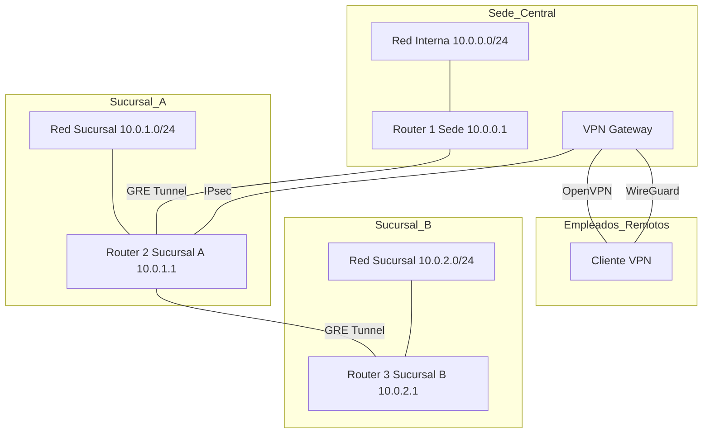

# Laboratorio 09 – VPN y Tunelización

## Contexto empresarial

La empresa **Networking SecOps** ya tiene su infraestructura de red con firewall, DMZ y servicios básicos (Laboratorio 08). Ahora necesita **conectar de forma segura** a empleados remotos y oficinas externas a través de Internet.

El equipo de redes ha identificado los siguientes requisitos:

1. **Conectar sucursales** de forma segura a la sede central.
2. **Permitir teletrabajo** para empleados desde sus casas.
3. **Proteger las comunicaciones** con cifrado.
4. **Soportar protocolos de enrutamiento** dinámico sobre VPN.

## Problema inicial

- Las sucursales están conectadas con enlaces directos (sin cifrado).
- Los empleados remotos no pueden acceder a recursos corporativos.
- No hay seguridad en las comunicaciones entre sedes.
- Se necesita una solución escalable y segura.

## Objetivos del laboratorio

1.  Comprender los conceptos de **VPN** y **tunelización**.
2.  Configurar un **túnel GRE** entre dos routers.
3.  Implementar **IPsec** para cifrar el tráfico entre sedes.
4.  Configurar **OpenVPN** para acceso remoto de empleados.
5.  Implementar **WireGuard** como alternativa ligera.
6.  Comparar las diferentes tecnologías VPN.

## Herramientas necesarias

- Linux con privilegios de superusuario.
- Comandos: `ip`, `ping`, `tcpdump`, `wg` (para WireGuard).
- `strongswan` o `libreswan` para IPsec.
- `openvpn` para OpenVPN.
- `wireguard-tools` para WireGuard.

## Topología

La topología extiende la del laboratorio 08 agregando túneles VPN.



**Direccionamiento:**

| Dispositivo | Interfaz | Dirección IP |
|-------------|----------|--------------|
| R1 (Sede) | eth0 (LAN) | 10.0.0.1/24 |
| R1 (Sede) | eth1 (R1-R2) | 192.168.1.1/30 |
| R1 (Sede) | WAN | 192.168.100.1/24 |
| R2 (Sucursal A) | eth0 (LAN) | 10.0.1.1/24 |
| R2 (Sucursal A) | eth1 (R1-R2) | 192.168.1.2/30 |
| R2 (Sucursal A) | eth2 (R2-R3) | 192.168.2.1/30 |
| R3 (Sucursal B) | eth0 (LAN) | 10.0.2.1/24 |
| R3 (Sucursal B) | eth1 (R2-R3) | 192.168.2.2/30 |
| VPN Gateway | - | 192.168.100.10/24 |
| Túnel GRE R1-R2 | gre1 | 10.10.0.1/30 |
| Túnel GRE R2-R3 | gre1 | 10.10.0.5/30 |
| OpenVPN Server | tun0 | 10.8.0.1/24 |
| WireGuard Server | wg0 | 10.9.0.1/24 |

## Construcción de la red

### Paso 1: Verificar infraestructura existente

Asegurémonos de que el laboratorio 08 está funcionando:

```bash
# Verificar namespaces
sudo ip netns list

# Verificar conectividad entre sede y sucursales
sudo ip netns exec clienteSede ping -c 2 10.0.1.10
```

### Paso 2: Configurar túnel GRE entre R1 y R2

Los túneles GRE permiten conectar redes no contiguas.

```bash
# En R1 (Sede)
sudo ip netns exec R1 ip tunnel add gre1 mode gre remote 192.168.1.2 local 192.168.1.1 ttl 255
sudo ip netns exec R1 ip addr add 10.10.0.1/30 dev gre1
sudo ip netns exec R1 ip link set gre1 up

# En R2 (Sucursal A)
sudo ip netns exec R2 ip tunnel add gre1 mode gre remote 192.168.1.1 local 192.168.1.2 ttl 255
sudo ip netns exec R2 ip addr add 10.10.0.2/30 dev gre1
sudo ip netns exec R2 ip link set gre1 up
```

### Paso 3: Verificar túnel GRE

```bash
# Verificar estado del túnel
sudo ip netns exec R1 ip tunnel show gre1

# Probar conectividad
sudo ip netns exec R1 ping -c 4 10.10.0.2
```

### Paso 4: Configurar túnel GRE entre R2 y R3

```bash
# En R2 (Sucursal A)
sudo ip netns exec R2 ip tunnel add gre2 mode gre remote 192.168.2.2 local 192.168.2.1 ttl 255
sudo ip netns exec R2 ip addr add 10.10.0.5/30 dev gre2
sudo ip netns exec R2 ip link set gre2 up

# En R3 (Sucursal B)
sudo ip netns exec R3 ip tunnel add gre2 mode gre remote 192.168.2.1 local 192.168.2.2 ttl 255
sudo ip netns exec R3 ip addr add 10.10.0.6/30 dev gre2
sudo ip netns exec R3 ip link set gre2 up
```

### Paso 5: Agregar rutas a través de los túneles GRE

```bash
# En R1 - ruta a Sucursal B vía túnel GRE
sudo ip netns exec R1 ip route add 10.0.2.0/24 via 10.10.0.2 dev gre1

# En R2 - rutas a Sede y Sucursal B vía túneles
sudo ip netns exec R2 ip route add 10.0.0.0/24 via 10.10.0.1 dev gre1
sudo ip netns exec R2 ip route add 10.0.2.0/24 via 10.10.0.6 dev gre2

# En R3 - ruta a Sede vía túnel GRE
sudo ip netns exec R3 ip route add 10.0.0.0/24 via 10.10.0.5 dev gre2
```

### Paso 6: Verificar conectividad a través de GRE

```bash
# Desde Sede a Sucursal B (a través de túnel GRE)
sudo ip netns exec clienteSede ping -c 4 10.0.2.10

# Ver tabla de enrutamiento en R1
sudo ip netns exec R1 ip route show
```

## Implementación de IPsec

### Paso 7: Configurar IPsec entre R1 y R2

**Configuración en R1 (Sede):**

```bash
# Instalar strongswan
sudo ip netns exec R1 apt-get update
sudo ip netns exec R1 apt-get install -y strongswan

# Configurar /etc/ipsec.conf
sudo ip netns exec R1 cat > /etc/ipsec.conf << 'EOF'
config setup
    charondebug="ike 2, knl 2, cfg 2"
    uniqueids=no

conn sede-sucursalA
    auto=start
    left=192.168.1.1
    leftsubnet=10.0.0.0/24
    right=192.168.1.2
    rightsubnet=10.0.1.0/24
    ikelifetime=28800s
    lifetime=3600s
    keyexchange=ikev2
    authby=secret
    ike=aes256-sha2_256-modp2048
    esp=aes256-sha2_256
EOF

# Clave precompartida
sudo ip netns exec R1 echo '192.168.1.1 192.168.1.2 : PSK "ClaveSecreta123"' > /etc/ipsec.secrets

# Iniciar IPsec
sudo ip netns exec R1 ipsec start
```

**Configuración en R2 (Sucursal A):**

```bash
# Configurar /etc/ipsec.conf en R2
sudo ip netns exec R2 cat > /etc/ipsec.conf << 'EOF'
config setup
    charondebug="ike 2, knl 2, cfg 2"
    uniqueids=no

conn sucursalA-sede
    auto=start
    left=192.168.1.2
    leftsubnet=10.0.1.0/24
    right=192.168.1.1
    rightsubnet=10.0.0.0/24
    ikelifetime=28800s
    lifetime=3600s
    keyexchange=ikev2
    authby=secret
    ike=aes256-sha2_256-modp2048
    esp=aes256-sha2_256
EOF

# Clave precompartida
sudo ip netns exec R2 echo '192.168.1.2 192.168.1.1 : PSK "ClaveSecreta123"' > /etc/ipsec.secrets

# Iniciar IPsec
sudo ip netns exec R2 ipsec start
```

### Paso 8: Verificar IPsec

```bash
# Verificar estado en R1
sudo ip netns exec R1 ipsec status

# Verificar asociaciones de seguridad
sudo ip netns exec R1 ip xfrm state

# Verificar políticas
sudo ip netns exec R1 ip xfrm policy
```

## Implementación de OpenVPN

### Paso 9: Configurar OpenVPN Server

```bash
# Instalar OpenVPN (en el VPN Gateway)
sudo ip netns exec VPN_GW apt-get update
sudo ip netns exec VPN_GW apt-get install -y openvpn

# Generar configuración
sudo ip netns exec VPN_GW cat > /etc/openvpn/server.conf << 'EOF'
port 1194
proto udp
dev tun
ca ca.crt
cert server.crt
key server.key
dh dh.pem
server 10.8.0.0 255.255.255.0
ifconfig-pool-persist ipp.txt
push "route 10.0.0.0 255.255.255.0"
push "route 10.0.1.0 255.255.255.0"
push "route 10.0.2.0 255.255.255.0"
keepalive 10 120
cipher AES-256-GCM
auth SHA256
user nobody
group nogroup
persist-key
persist-tun
status openvpn-status.log
verb 3
EOF

# Iniciar OpenVPN
sudo ip netns exec VPN_GW systemctl start openvpn@server
```

### Paso 10: Configurar cliente OpenVPN

```bash
# En el cliente remoto
sudo ip netns exec clienteVPN openvpn --config client.ovpn
```

## Implementación de WireGuard

### Paso 11: Configurar WireGuard Server

```bash
# Instalar WireGuard (en el VPN Gateway)
sudo ip netns exec VPN_GW apt-get update
sudo ip netns exec VPN_GW apt-get install -y wireguard

# Generar claves
sudo ip netns exec VPN_GW wg genkey | tee /etc/wireguard/privatekey | wg pubkey > /etc/wireguard/publickey

# Configurar interfaz
sudo ip netns exec VPN_GW cat > /etc/wireguard/wg0.conf << 'EOF'
[Interface]
Address = 10.9.0.1/24
ListenPort = 51820
PrivateKey = CLAVE_PRIVADA_SERVIDOR
SaveConfig = false

[Peer]
PublicKey = CLAVE_PUBLICA_CLIENTE
AllowedIPs = 10.9.0.2/32
EOF

# Activar interfaz
sudo ip netns exec VPN_GW wg-quick up wg0
```

### Paso 12: Configurar cliente WireGuard

```bash
# En el cliente remoto
sudo ip netns exec clienteVPN cat > /etc/wireguard/wg0.conf << 'EOF'
[Interface]
Address = 10.9.0.2/24
PrivateKey = CLAVE_PRIVADA_CLIENTE
ListenPort = 51820

[Peer]
PublicKey = CLAVE_PUBLICA_SERVIDOR
Endpoint = 192.168.100.10:51820
AllowedIPs = 10.0.0.0/8
PersistentKeepalive = 25
EOF

# Activar
sudo ip netns exec clienteVPN wg-quick up wg0
```

### Paso 13: Verificar WireGuard

```bash
# Verificar estado del servidor
sudo ip netns exec VPN_GW wg show

# Verificar conectividad
sudo ip netns exec clienteVPN ping -c 4 10.9.0.1
```

## Análisis y comparación

### Paso 14: Comparar tecnologías VPN

| Tecnología | Capa | Ventajas | Desventajas |
|------------|------|----------|-------------|
| GRE | 3 | Sencillo, soporta multicast | Sin cifrado |
| IPsec | 3 | Seguro, estándar | Complejo, NAT issues |
| OpenVPN | 3-4 | Flexible, SSL/TLS | Mayor overhead |
| WireGuard | 3 | Ligero, moderno | Menos funciones |

### Paso 15: Analizar overhead de encapsulación

```bash
# Capturar tráfico GRE
sudo ip netns exec R1 tcpdump -i gre1 -n -v

# Capturar tráfico IPsec
sudo ip netns exec R1 tcpdump -i veth-r1r2 -n -v esp
```

**Interpretación:**
- GRE añade 4 bytes de overhead.
- IPsec añade ~50-70 bytes de overhead.
- OpenVPN añade ~60-80 bytes de overhead.
- WireGuard añade ~40-50 bytes de overhead.

## Ejercicios prácticos

### Ejercicio 1: Agregar un nuevo túnel GRE

Configura un túnel GRE entre R1 y R3 directo para redundancia.

```bash
# En R1
sudo ip netns exec R1 ip tunnel add gre3 mode gre remote 192.168.3.2 local 192.168.3.1 ttl 255
sudo ip netns exec R1 ip addr add 10.10.0.9/30 dev gre3
sudo ip netns exec R1 ip link set gre3 up

# En R3
sudo ip netns exec R3 ip tunnel add gre3 mode gre remote 192.168.3.1 local 192.168.3.2 ttl 255
sudo ip netns exec R3 ip addr add 10.10.0.10/30 dev gre3
sudo ip netns exec R3 ip link set gre3 up
```

### Ejercicio 2: Agregar rutas redundantes

Configura rutas con métrica diferente para failover.

```bash
# En R1
sudo ip netns exec R1 ip route add 10.0.2.0/24 via 10.10.0.9 dev gre3 metric 100
```

### Ejercicio 3: Configurar WireGuard en Sucursal

Implementa WireGuard entre R2 y R3 como alternativa.

## Errores comunes y soluciones

| Error | Causa | Solución |
|-------|-------|----------|
| Túnel GRE no sube | IPs de extremos incorrectas | Verificar `ip tunnel show` |
| IPsec no establece | Claves no coinciden | Verificar PSK en ambos extremos |
| OpenVPN no conecta | Certificados expirados | Regenerar certificados |
| WireGuard no handshake | Puerto bloqueado | Verificar firewall |

## Conceptos clave del Tema 9 aplicados

| Concepto | Aplicación en el laboratorio |
|----------|------------------------------|
| GRE | Túneles entre R1-R2 y R2-R3 |
| IPsec | Cifrado entre sedes |
| OpenVPN | Acceso remoto de empleados |
| WireGuard | VPN ligera y moderna |
| Tunelización | Encapsulación de tráfico |

## Conclusiones técnicas

En este laboratorio hemos:

1.  Configurado **túneles GRE** para conectar redes no contiguas.
2.  Implementado **IPsec** para cifrar comunicaciones entre sedes.
3.  Configurado **OpenVPN** para acceso remoto de empleados.
4.  Implementado **WireGuard** como alternativa moderna y ligera.
5.  Comparado las diferentes tecnologías VPN y sus características.

Las VPN son esenciales para conectar sedes y proporcionar acceso remoto seguro. GRE ofrece encapsulación simple y soporte para multicast, IPsec proporciona seguridad robusta y es el estándar empresarial, OpenVPN ofrece flexibilidad y amplia compatibilidad, y WireGuard destaca por su simplicidad, rendimiento y criptografía moderna.

## Preparación para el siguiente laboratorio

Hemos dejado la red con túneles GRE, IPsec, OpenVPN y WireGuard funcionando. En el **Laboratorio 10** exploraremos **Infraestructura WAN y Core**, implementando enrutamiento dinámico OSPF y BGP para redes de gran escala.

---

**¡Laboratorio 09 completado!** Has implementado VPN y tunelización. Continúa con el **Laboratorio 10**.
