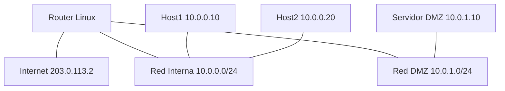

# Laboratorio 14 – Herramientas Linux Avanzadas

## Contexto empresarial

La empresa **Networking SecOps** ha implementado su infraestructura de red y sistemas de monitoreo (Laboratorio 13). Ahora el equipo de operaciones necesita dominar las herramientas avanzadas de Linux para administrar, diagnosticar y optimizar la red de manera eficiente.

## Topología



**Direccionamiento:**

| Dispositivo | Interfaz | Dirección IP |
|-------------|----------|--------------|
| Router Linux | eth0 (WAN) | 203.0.113.1/30 |
| Router Linux | eth1 (LAN) | 10.0.0.1/24 |
| Router Linux | eth2 (DMZ) | 10.0.1.1/24 |
| Host1 | - | 10.0.0.10/24 |
| Host2 | - | 10.0.0.20/24 |
| Servidor DMZ | - | 10.0.1.10/24 |

## Construcción

### Paso 1: Crear namespaces

```bash
sudo ip netns add Router
sudo ip netns add Host1
sudo ip netns add Host2
sudo ip netns add ServidorDMZ
```

### Paso 2: Conectar interfaces

```bash
sudo ip link add veth-r-wan type veth peer name veth-wan-r
sudo ip link set veth-r-wan netns Router
sudo ip netns exec Router ip addr add 203.0.113.1/30 dev veth-r-wan
sudo ip netns exec Router ip link set veth-r-wan up
sudo ip addr add 203.0.113.2/30 dev veth-wan-r
sudo ip link set veth-wan-r up

sudo ip link add veth-r-lan1 type veth peer name veth-lan1-r
sudo ip link set veth-r-lan1 netns Router
sudo ip netns exec Router ip addr add 10.0.0.1/24 dev veth-r-lan1
sudo ip netns exec Router ip link set veth-r-lan1 up
sudo ip link set veth-lan1-r netns Host1
sudo ip netns exec Host1 ip addr add 10.0.0.10/24 dev veth-lan1-r
sudo ip netns exec Host1 ip link set veth-lan1-r up
sudo ip netns exec Host1 ip route add default via 10.0.0.1

sudo ip link add veth-r-lan2 type veth peer name veth-lan2-r
sudo ip link set veth-r-lan2 netns Router
sudo ip netns exec Router ip addr add 10.0.1.1/24 dev veth-r-lan2
sudo ip netns exec Router ip link set veth-r-lan2 up
sudo ip link set veth-lan2-r netns ServidorDMZ
sudo ip netns exec ServidorDMZ ip addr add 10.0.1.10/24 dev veth-lan2-r
sudo ip netns exec ServidorDMZ ip link set veth-lan2-r up
sudo ip netns exec ServidorDMZ ip route add default via 10.0.1.1
```

### Paso 3: Configurar enrutamiento

```bash
sudo ip netns exec Router sysctl -w net.ipv4.ip_forward=1
sudo ip netns exec Router ip route add default via 203.0.113.2
sudo ip netns exec Router ip route show
```

### Paso 4: iproute2

```bash
sudo ip netns exec Router ip addr show
sudo ip netns exec Router ip link set veth-r-lan1 mtu 9000
sudo ip netns exec Router ip route add 10.0.2.0/24 via 10.0.0.1
sudo ip netns exec Router ip neigh show
sudo ip netns exec Router ip rule show
```

### Paso 5: ss

```bash
sudo ip netns exec Router ss -tln
sudo ip netns exec Router ss -tulpn
sudo ip netns exec Router ss -tn state established
sudo ip netns exec Router ss -tnp dport = :443
```

### Paso 6: nftables

```bash
sudo ip netns exec Router nft add table inet filter
sudo ip netns exec Router nft add chain inet filter input { type filter hook input priority 0; policy drop; }
sudo ip netns exec Router nft add rule inet filter input iif lo accept
sudo ip netns exec Router nft add rule inet filter input ct state established,related accept
sudo ip netns exec Router nft add rule inet filter input tcp dport 22 accept
sudo ip netns exec Router nft add rule inet filter input tcp dport { 80, 443 } accept
sudo ip netns exec Router nft list ruleset
```

### Paso 7: Diagnóstico

```bash
sudo ip netns exec Router ethtool veth-r-lan1
sudo ip netns exec Router ping -c 4 10.0.0.10
sudo ip netns exec Router traceroute -n 8.8.8.8
sudo ip netns exec Router tcpdump -i veth-r-lan1 -c 5 -n
```

## Ejercicios

### Ejercicio 1: Agregar regla nftables para bloquear ICMP

```bash
sudo ip netns exec Router nft add rule inet filter input ip protocol icmp drop
```

### Ejercicio 2: Verificar conexiones con ss

```bash
sudo ip netns exec Host1 nc -l -p 9000 &
sudo ip netns exec Host2 nc 10.0.0.10 9000
sudo ip netns exec Router ss -tn state established
```

## Conceptos clave

| Concepto | Aplicación |
|----------|------------|
| iproute2 | Administración moderna de red |
| ss | Análisis de sockets |
| nftables | Firewall moderno |
| ethtool | Diagnóstico físico |
| Netcat | Pruebas de conectividad |

## Conclusiones

Las herramientas avanzadas de Linux permiten administrar y diagnosticar redes de manera eficiente, reemplazando las herramientas tradicionales obsoletas.

---

**¡Laboratorio 14 completado!** Continúa con el **Laboratorio 15**.
